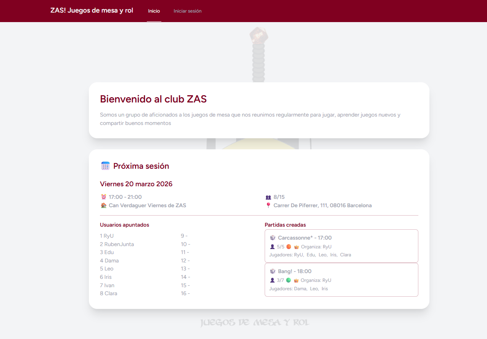
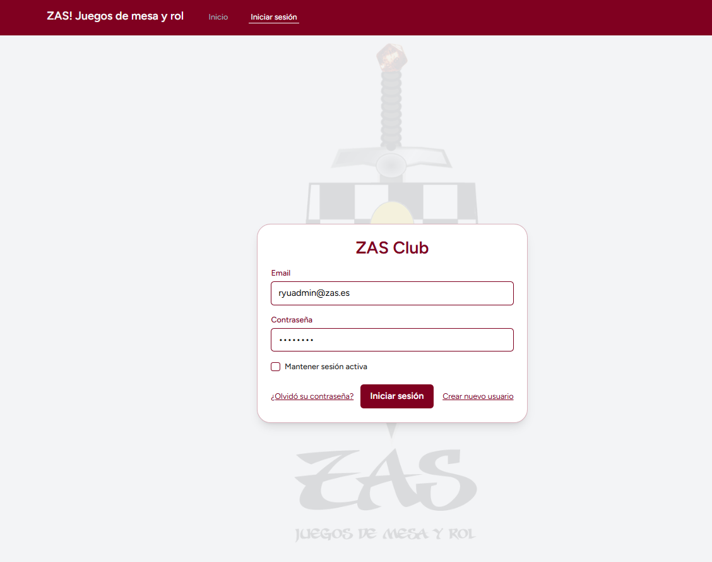
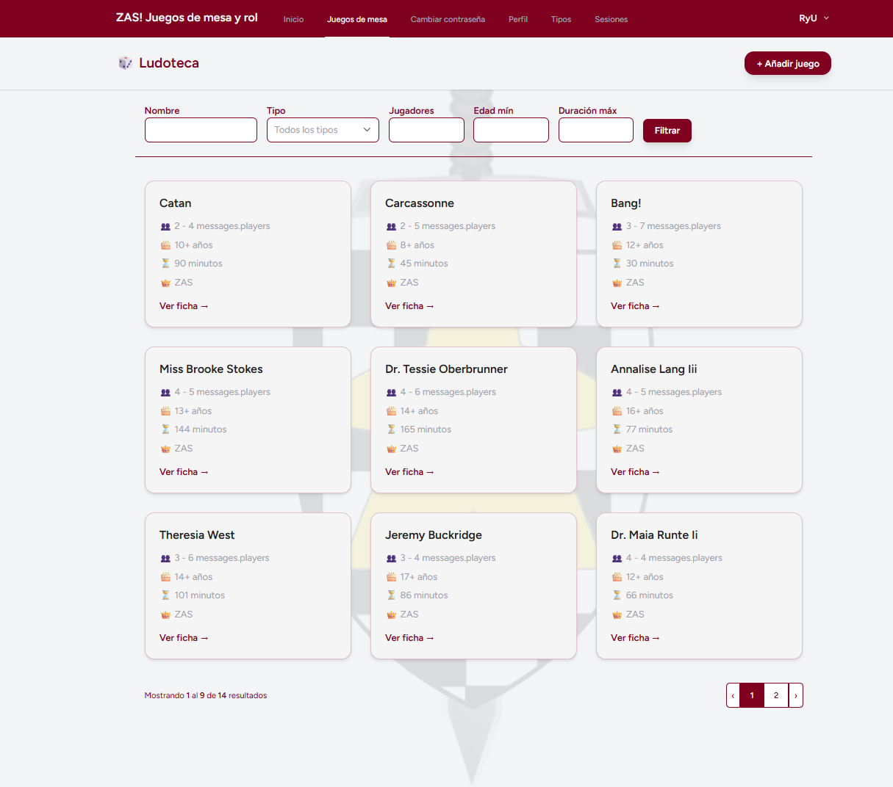
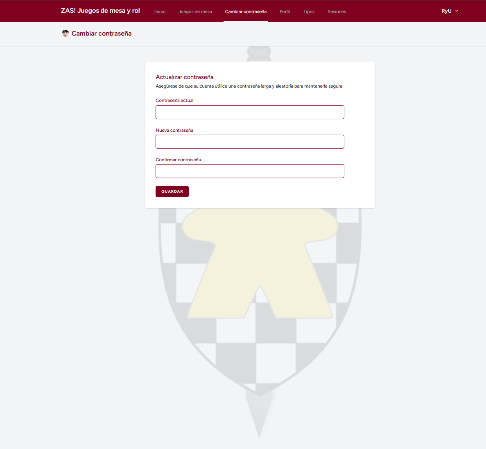
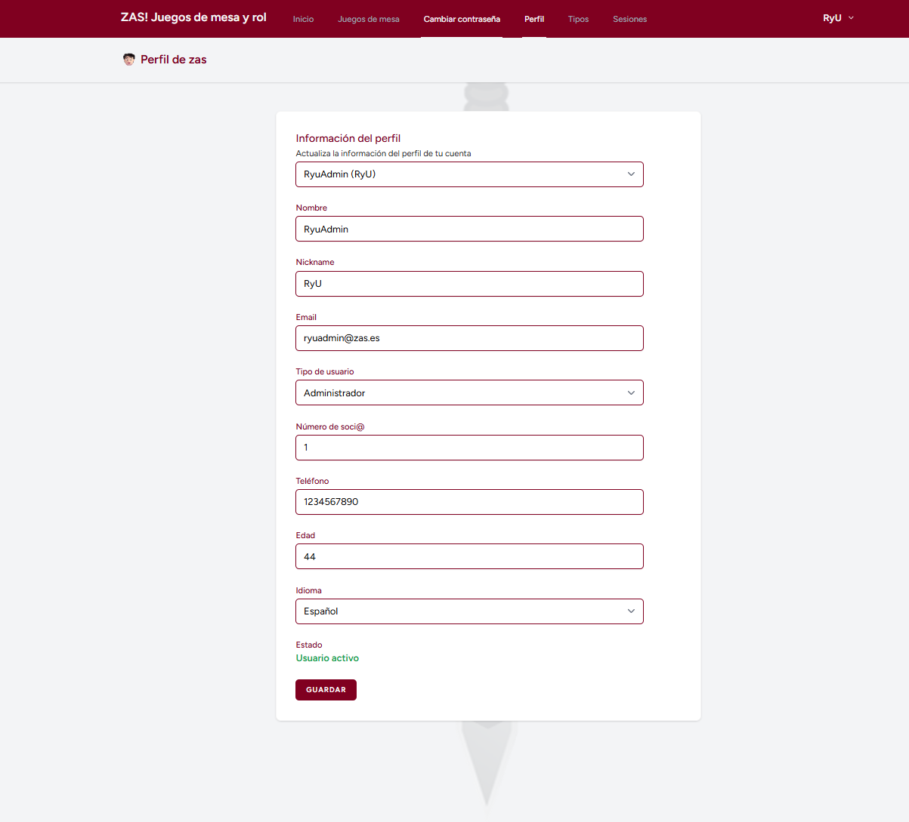
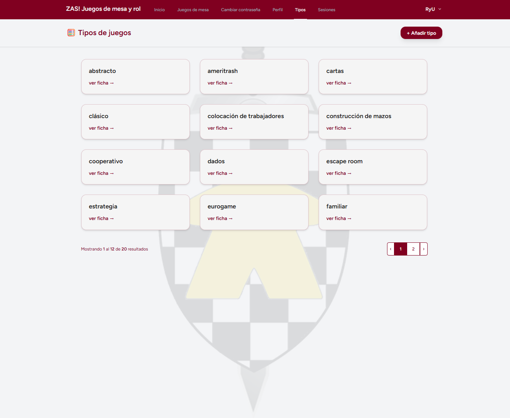
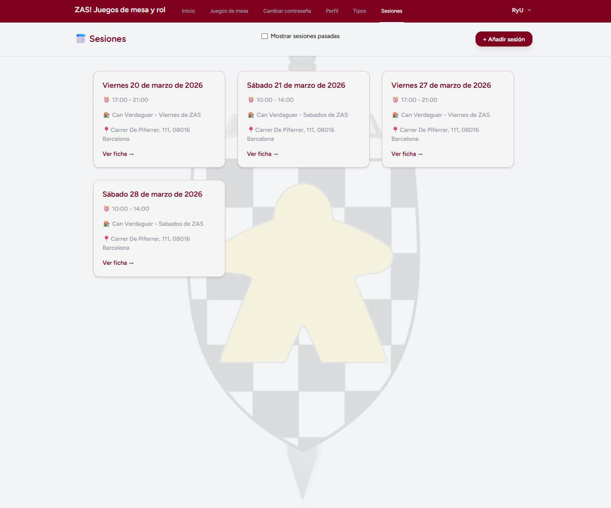

# 🎲 ZAS! Juegos de Mesa y Rol

Aplicación web desarrollada con Laravel como parte de un curso de programación web.
El proyecto consiste en la gestión de un club de juegos de mesa, permitiendo administrar usuarios, sesiones, juegos y participación en partidas.

## Tabla de contenidos

- [Descripción](#descripción)
- [Cómo funciona](#cómo-funciona)
- [Capturas de pantalla](#capturas-de-pantalla)
- [Cuentas demo](#cuentas-demo)
- [Stack técnico](#stack-técnico)
- [Arquitectura del sistema](#arquitectura-del-sistema)
- [Funcionalidades principales](#funcionalidades-principales)
- [Idiomas](#idiomas)
- [Instalación](#instalación)
- [Estructura del proyecto](#estructura-del-proyecto)
- [Ramas del proyecto](#ramas-del-proyecto)
- [Metodología](#metodología)
- [Limitaciones actuales](#limitaciones-actuales)
- [Estado del proyecto](#estado-del-proyecto)
- [Mejoras futuras](#mejoras-futuras)
- [Autor](#autor)

---

## 📌 Descripción

ZAS! Juegos de Mesa y Rol es una plataforma web que permite a los miembros de un club:

- ✅ Consultar juegos disponibles
- ✅ Organizar sesiones de juego
- ✅ Crear y unirse a partidas
- ✅ Gestionar su perfil y preferencias
- ✅ Administrar contenido según roles
- ✅ El sistema incluye control de acceso por roles para diferenciar permisos entre usuarios.

---

## 🧭 Cómo funciona

1. El usuario accede a la página inicial donde puede ver información del club.
2. Puede registrarse, iniciar sesión o recuperar contraseña.
3. Una vez autenticado:
   - Accede al panel principal
   - Ve opciones según su rol

### Funcionalidades disponibles

- 🎲 **Juegos de mesa**
  - Visualización para todos
  - CRUD para Admin y Junta

- 🔑 **Cambio de contraseña**
  - Disponible para todos los usuarios

- 🧑🏻‍🦱 **Perfil**
  - Edición de datos personales
  - Selección de idioma
  - Gestión de usuarios (Admin)

- 🧮 **Tipos**
  - Gestión de categorías de juegos (Admin/Junta)

- 📅 **Sesiones**
  - Inscripción a sesiones
  - Creación de partidas
  - Gestión por Admin/Junta

- 🔓 **Logout**
  - Disponible desde la barra de navegación

---

## 📸 Capturas de pantalla

---

## 🔑 Cuentas demo

Usuarios disponibles para probar la aplicación:

- **Admin**
  - Email: rubenadmin@zas.es  
  - Password: RubenAdmin  

- **Junta**
  - Email: rubenjunta@zas.es  
  - Password: RubenJunta  

- **Partner**
  - Email: rubenpartner@zas.es  
  - Password: RubenPartner  

- **Guest**
  - Email: rubenguest@zas.es  
  - Password: RubenGuest  

---

## 🛠️ Stack Técnico

- **Backend:** Laravel 12 (PHP 8.2+)
- **Frontend:** Blade + TailwindCSS + Vite + Javascript
- **Base de datos:** MySQL + Laravel Eloquent
- **Autenticación:** Laravel Breeze
- **Entorno:** Visual studio code 1.111
- **Patrón:** Patron MVC
- **Recuperación contraseña:** Correo mailtrap
- **Repositorio:** Github con gitflow

---

## 🏗️ Arquitectura del sistema

La aplicación está desarrollada siguiendo el patrón MVC (Modelo-Vista-Controlador) utilizando Laravel como framework principal.

### Componentes principales

- **Modelos (Eloquent ORM):**
  Representan las entidades del sistema:

  - Usuarios
  - Juegos de mesa
  - Tipos de juego
  - Sesiones
  - Partidas

- **Controladores:**
  Gestionan la lógica de negocio y las peticiones HTTP, coordinando la interacción entre modelos y vistas.

- **Vistas (Blade + TailwindCSS):**
  Renderizan la interfaz de usuario.  
  Se utiliza TailwindCSS para el diseño y Vite para la gestión de assets.

- **Autenticación:**
  Implementada mediante Laravel Breeze:
  - Registro
  - Login / Logout
  - Gestión de sesiones
  - Cambio de contraseña
  - Recuperación de contraseña

- **Middleware y control de acceso:**
  Sistema basado en roles:
  - Admin
  - Junta
  - Partner
  - Guest  

---

### 🔄 Flujo de la aplicación

1. El usuario accede a la aplicación
2. Se realiza una petición HTTP
3. Laravel la enruta a un controlador
4. El controlador procesa la lógica
5. Se interactúa con la base de datos mediante Eloquent
6. Se devuelve una vista renderizada al usuario

---

### 🔗 Relaciones clave

- Un usuario puede:
  - Participar en múltiples sesiones
  - Crear o unirse a varias partidas

- Una sesión:
  - Contiene múltiples partidas
  - Permite inscripción de usuarios

- Un juego:
  - Pertenece a uno o varios tipos

---

### 🔐 Control de permisos

- **Admin:** acceso total y gestión de usuarios
- **Junta:** gestión de contenido (juegos, tipos, sesiones y partidas)
- **Partner:** interacción con sesiones y partidas
- **Guest:** acceso limitado

---

## ⚙️ Funcionalidades principales

### Páginas públicas
- Pantalla de bienvenida (welcome)
- Login de usuarios

### Páginas logeadas

- Juegos de mesa
    Visible para todos los usuarios
    CRUD completo para:
    Admin
    Junta

- Perfil
    Visible para todos los usuarios
    Funcionalidades:
    Editar datos personales
    Seleccionar idioma de la web
    Funcionalidades extra (Admin):
    Editar perfiles de otros usuarios
    Desactivar/reactivar usuarios

- Cambio de contraseña
    Disponible para todos los usuarios

- Tipos de juegos
    Acceso restringido a:
    Admin
    Junta
    CRUD completo para clasificar juegos

- Sesiones
    Visible para todos los usuarios
    Funcionalidades:
    Apuntarse a sesiones
    Crear partidas dentro de una sesión
    Unirse a partidas
    Gestión (solo Admin y Junta):
    Crear sesiones
    Editar sesiones
    Eliminar sesiones

---

## 🌍 Idiomas

La aplicación permite seleccionar el idioma desde el perfil:

- 🇪🇸 Castellano  
- 🇬🇧 Inglés  
- 🏴 Catalán  

---

## ⚙️ Instalación

    # Clonar repositorio
    git clone https://github.com/josemanuelriu-cmd/PHP_FULLSTACK_S4_T1    

    cd PHP_FULLSTACK_S4_T1\WebZas
    # es necesario tener instalado node.js. Instalarlo si no se tiene:
    https://nodejs.org/en/download
    
    # Instalar dependencias
    composer install
    npm install && npm run dev

    # Configurar entorno
    cp .env.example .env

    # Generar clave
    php artisan key:generate

    # Configurar base de datos en .env

    # Migraciones
    php artisan migrate

    # (Opcional) Seeders
    php artisan db:seed

    # Levantar servidor
    php artisan serve

---

## 📂 Estructura del proyecto

app/        -> Lógica de la aplicación
routes/     -> Rutas
resources/  -> Vistas (Blade) y assets
database/   -> Migraciones y seeders
public/     -> Archivos públicos
MER/        -> Diagramas de base de datos

---

## 🌿 Ramas del proyecto

### `main`

Rama base de Laravel. Contiene el proyecto limpio.

### `develop`

Rama de desarrollo con el código actual del proyecto:
- Instalaciones: Breeze y Vite
- Migracion, seeders y factories
- CRUD completo de usuarios, juegos, tipos, partidas
- Sistema de multilenguaje

---

## 🧠 Metodología

- Repositorio en github con GitFlow y pull requests
- Migraciones y seeders para base de datos
- Modelo Vista Controlador (MVC)
- Paginación 

---

## ⚠️ Limitaciones actuales

- Los tipos de juegos están definidos como ENUM y no pueden ampliarse dinámicamente
- No se pueden añadir a partidas a otros jugadores, salvo el host en el momento de la creación

---

## 🚀 Mejoras futuras

- Chat interno con Laravel Reverb
- CRUD para eventos
- Testing con Pest
- Mejoras visuales con Livewire
- Mejoras en traducción
- Añadir imágenes y vídeos a juegos
- Footer con redes sociales
- Importación de datos reales
- Despliegue en producción con dominio propio
- Creación de API REST

---

## 📊 Estado del proyecto

Proyecto académico desarrollado como práctica dentro de un curso de desarrollo web en PHP.

---

## 👨‍💻 Autor

Jose Manuel Riu
GitHub: https://github.com/josemanuelriu-cmd

